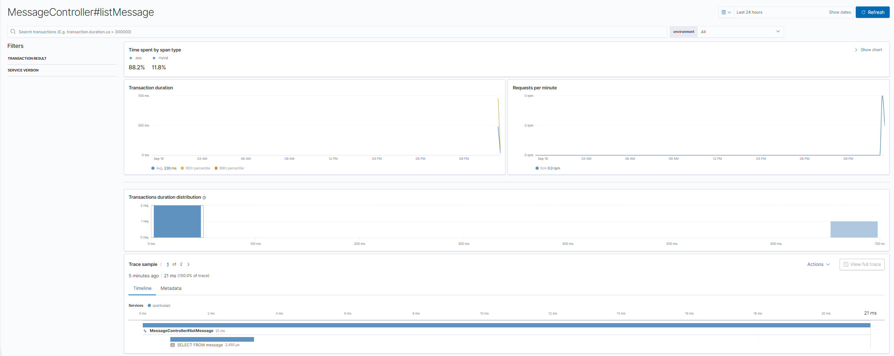
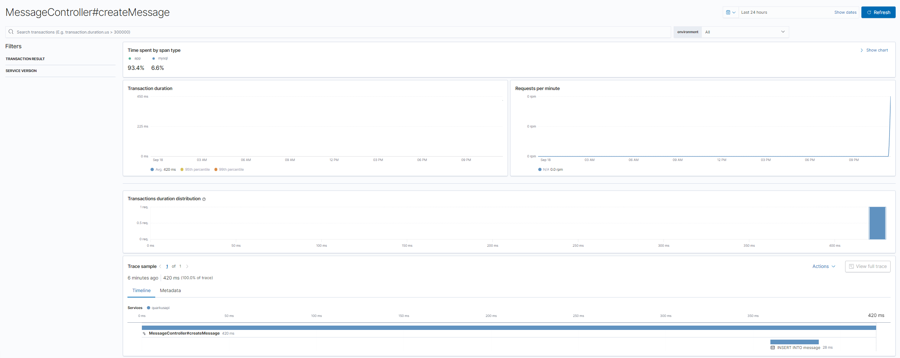
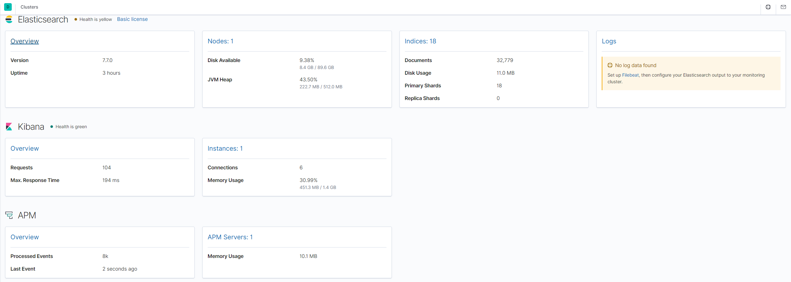

# Quarkus API with APM using Elastic Stack

A sample API fetching data from MySQL, exposing metrics with prometheus and using application monitoring with Elastic APM.

## Up and Running

```bash
export DOCKER_BUILDKIT=1
export COMPOSE_DOCKER_CLI_BUILD=1

# up database
docker-compose up -d mysql
docker-compose logs -f --tail 100 mysql

# up ELK stack
docker-compose up -d elasticsearch kibana apm_server
docker-compose logs -f --tail 100 elasticsearch kibana apm_server

# build and up the API
docker-compose up -d --build quarkusapi
docker-compose logs -f --tail 100 quarkusapi

# up metricbeat
docker-compose up -d metricbeat
docker-compose logs -f --tail 100 metricbeat

eval $(cat .env | xargs)
docker container exec -it mysql sh -c "mysql -u$DB_USERNAME -p$DB_PASSWORD -h127.0.0.1 -P$DB_PORT -e 'SELECT * FROM $DB_DATABASE.message'"
```

## Services

> API: port 8080

> Elasticsearch: port 9200

> Kibana: port 5601

> APM Server: port 8200

## Trying messages API

```bash
# service endpoints
curl --silent -X POST --data-raw '{"userId": 1, "content": "Hello World 1"}' -H 'Content-Type: application/json' --url 'http://localhost:8080/v1/messages'

curl --silent -X POST --data-raw '{"userId": 2, "content": "Hello World 2"}' -H 'Content-Type: application/json' --url 'http://localhost:8080/v1/messages'

curl --silent -X GET --url 'http://localhost:8080/v1/messages'

curl --silent -X GET --url 'http://localhost:8080/v1/messages/1'

curl --silent -X GET --url 'http://localhost:8080/v1/messages/user/1'

curl --silent -X GET --url 'http://localhost:8080/v1/messages/user/2'

# micrometer endpoints
curl --silent -X GET --url "http://127.0.0.1:8080/q/metrics"

curl --silent -X GET --url "http://127.0.0.1:8080/q/health/ready"

curl --silent -X GET --url "http://127.0.0.1:8080/q/health/live"

# generate some traffic
while true; do
  USER_ID=$RANDOM
  curl --silent -X POST -H 'Content-type: application/json' \
    --data-raw "{\"userId\": $USER_ID, \"content\": \"Message from user - $USER_ID\"}" \
    --url "http://127.0.0.1:8080/v1/messages" > /dev/null
  curl --silent -X GET --url "http://127.0.0.1:8080/v1/messages/user/$USER_ID" > /dev/null
  curl --silent -X GET --url "http://127.0.0.1:8080/v1/messages" > /dev/null
done
```

## APM Traces

Some examples of traces:





## Metricbeat metrics


